## Table of contents 

+ [Prepare the VM](#prepare-the-vm)
+ [Improve the performence](#improve-the-performence)
+ [Disable Windows Defender](#turn-off-windows-defender)
+ [Install Programming Utilities](#install-visual-studio-and-programming-utitilies)
+ [Install Reverse Engineering Utilities](#install-reverse-engineering-utilities)

## Prepare the VM

### To download

1. Download and install Virtual Box from [here](https://www.virtualbox.org/)
2. Download Windows 10 test machine from [here](https://developer.microsoft.com/en-us/microsoft-edge/tools/vms/) - version for Virtual Box


### Setting up the VM

1. Unpack the `MSEdge.Win10.VirtualBox.zip`. You will find there `MSEdge - Win10.ova`. It is a Virtual Box Appliance.
2. Run the Virtual Box and import the appliance:

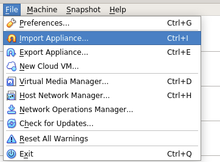

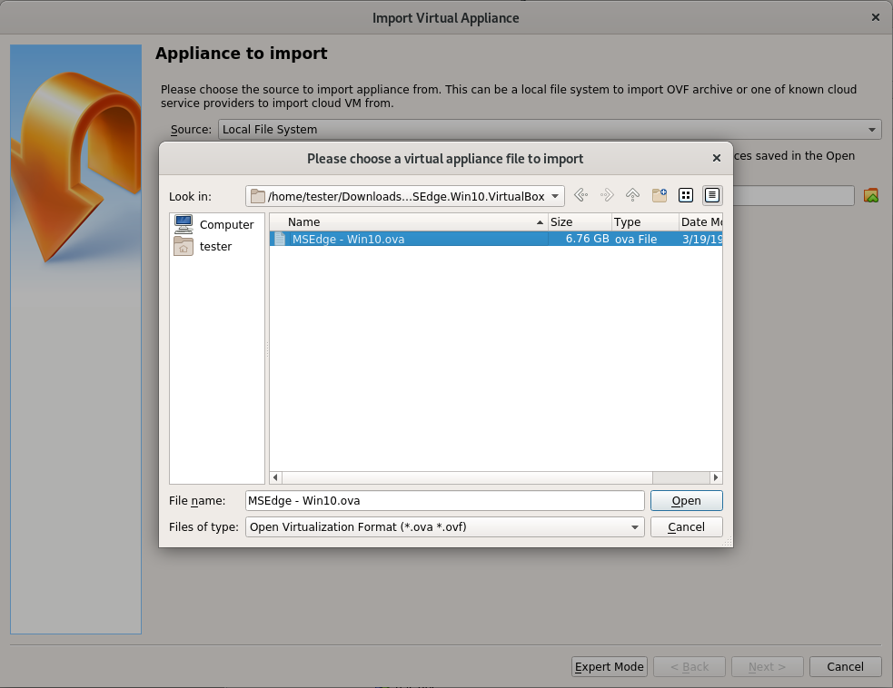

Wait for it to import...


3. Few options should be edited before the first run

3.1. Display Settings:

+ Increase the default Video Memory (move the slider to the green area)

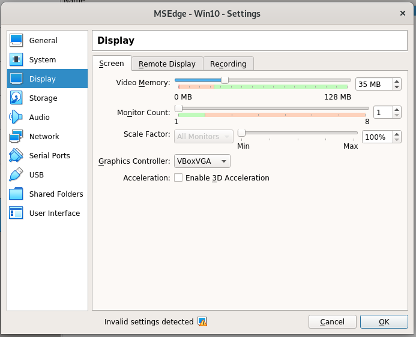

+ Change the Graphics Controller to `VBoxSVGA`


3.2. Add `Optical Drive` (Empty)


3.3. Add a shared folder
 + named `training_shared`
 + mapped to a `Mount point` `Z`
 + set to `Auto-mount`

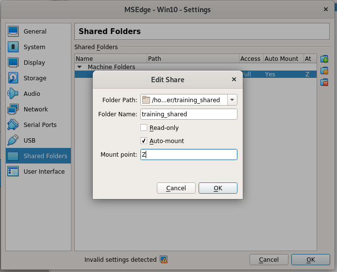


4. Run the Virtual Machine for the first time


Log into the system. The password is `Passw0rd!`.

5. Install the Guest Additions.

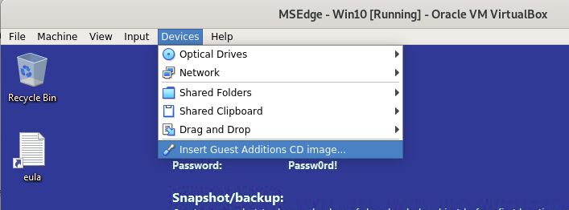

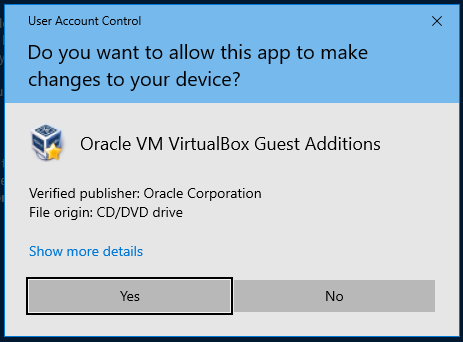

Reboot the machine after installation:

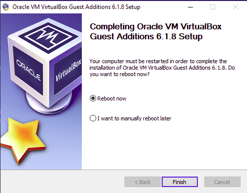

5. Resize the disk

We will be installing a lot of tools that are going to consume space, and the disk given by default with this appliance is not sufficient. We need to resize it (to 80 GB). 

+ Ensure that at this step your VM doesn't have any snapshots. If it has, they must be deleted before you can continue.
+ Shut down the VM
+ Resize the disk to 80GB:

  + Option 1) from command line
  
***

 Go to the directory when your Virutal Disk is located (in `MSEdge - Win10`). Type the command (*assuming that `Win10-disk001.vdi` is the disk of our VM*):

```
VBoxManage modifyhd "MSEdge - Win10-disk001.vdi" --resize 81920
```


***
 
  + Option 2) from GUI:

***

 `File` -> `Virtual Media Manager`
 
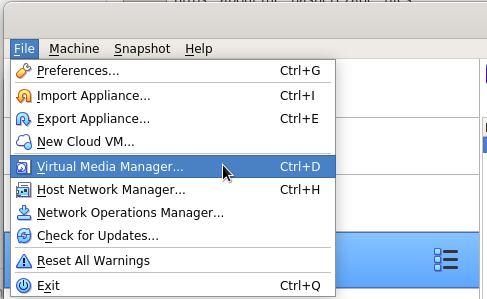

Select the disk related to our VM. Set the slder to 80 GB. Click `Apply`.
 
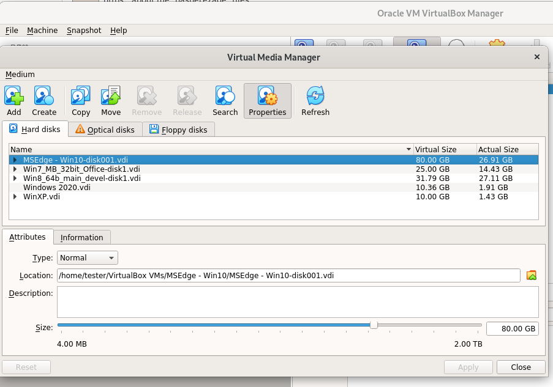


***
 
After it is done, we need to resize the partition that is accessible to the VM.

+ Start the VM
+ From the menu, search "partitions"

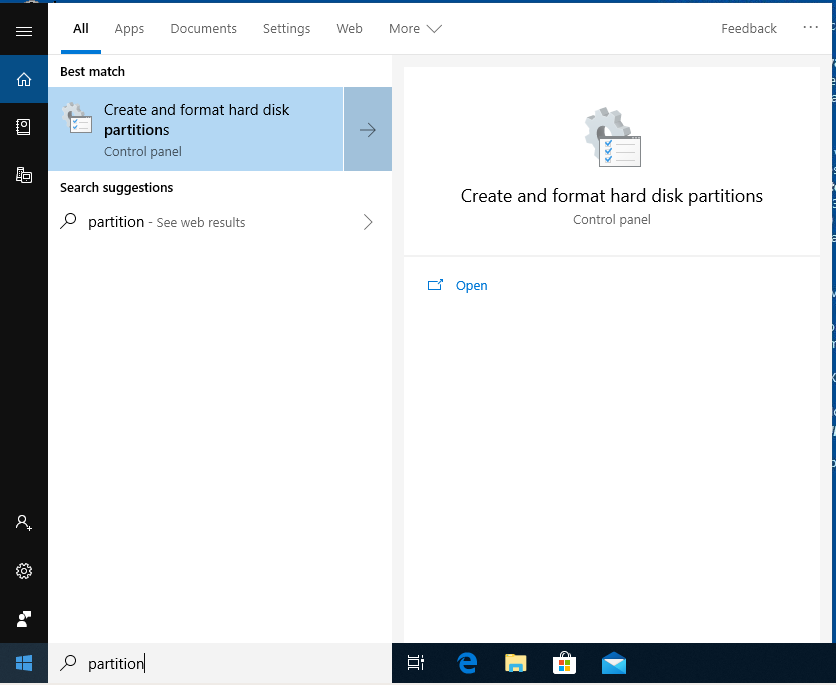

+ Click "Extend Volume"

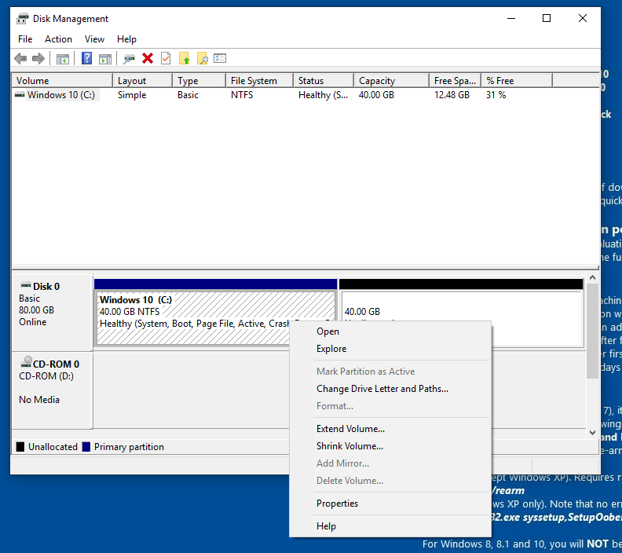

Go throug and accept the default settings. The accessible partition should expand to fill all the space:

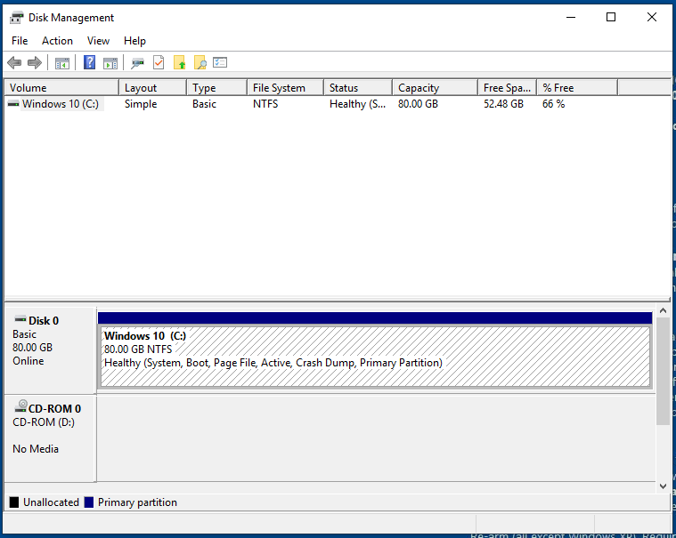


6. Make a snapshot in the "Fresh" state.

After reboot, log into the VM again. Make a snapshot.


## Improve the performence

### VM changes

+ Remote display: Enable Server: Off
+ System -> Motherboard -> Increase `Base Memory` (choose the limit according to capabilities of your physical machine)
+ Display -> Screem -> Increase `Video Memory` (choose the limit according to capabilities of your physical machine)

### System changes

Windows 10 is pretty bulky and resource-demanding. So, you may want to improve the performence of you VM by making some additional changes.

1. Uninstall redundant apps:
+ Microsoft News
+ Microsoft Silverlight
+ Skype
+ Feedback Hub

2. Use minimalistic UI

Open Advanced system settings -> System Properties. On the `Advanced` tab under `Performance`, click `Settings...`.
On the tab `Visual effects` choose `Adjust for best performance`.

3. Disable redundant starup apps.

Open `Task Manager`, then on the tab `Startup` disable everything except the Virtual Box addons.

4. Changes in **Windows Settings**:

+ **Background apps** (important to disable):
  + Let apps run in the background: Off

+ General: Off (everyhing)
  + Let app use advertising ID to make ads [...]: Off
  + Let websites provide localy relevant content[...]: Off
  + Let Windows track app launches: Off

+ Diagnostics & feedback:
  + Set to "Basic"
  + Tailored expiriences: Off
  + Imprtove inking and typing: Off

+ Inking and typing: Off

+ Call history:
  + Allow aps to access your call history: Off

+ Microphone:
  + Allow apps to access your microphone: Off

+ Camera:
  + Allow apps to access your camera: Off

## Turn off Windows Defender

### Disable Defender Firewall

1. Search `defender`


2. Disable firewall for both Public and Private networks:

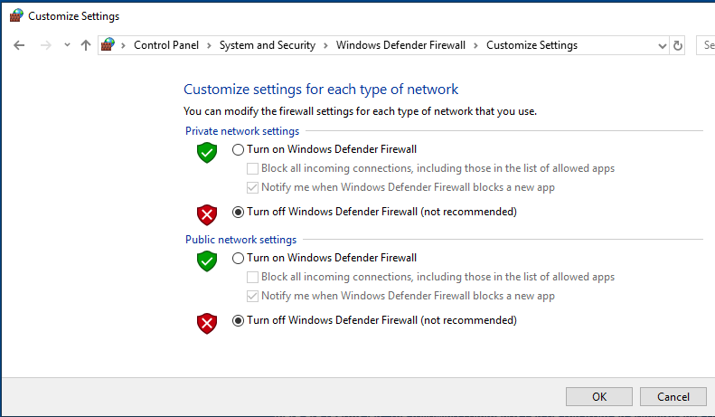

### Disable Defender Antivirus

1. Search "gpedit.msc"
2. In window "Local Group Policy Editor":
+ Select: `Computer Configuration` -> `Administrative Templates` -> `Windows Components` -> `Windows Defender Antivirus`

 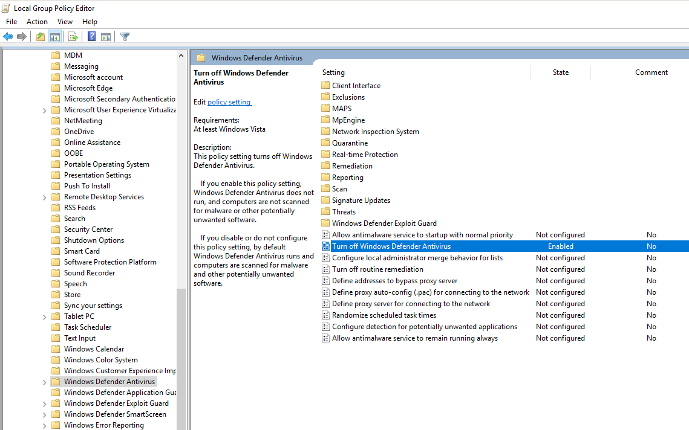

+ Edit: `Turn off Windows Defender Antivirus` -> select: `Enabled` -> click `OK`
 
 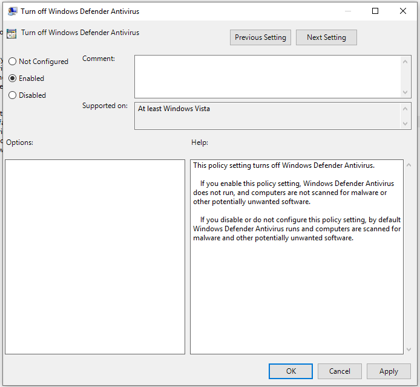


## Install Visual Studio and programming utitilies

### To download

+ Visual Studio from [here](https://visualstudio.microsoft.com/downloads/) - Community version
+ [Windows 10 SDK](https://developer.microsoft.com/en-us/windows/downloads/windows-10-sdk/)
+ [Windows 10 WDK](https://docs.microsoft.com/en-us/windows-hardware/drivers/download-the-wdk)
+ Git for Windows from [here](https://git-scm.com/downloads)
+ CMake from [here](https://cmake.org/download/)

### Setting up the Visual Studio

1. Run the installer (`vs_community__<version>.exe`)
2. Select:
+ .NET desktop development
+ Desktop development with C++

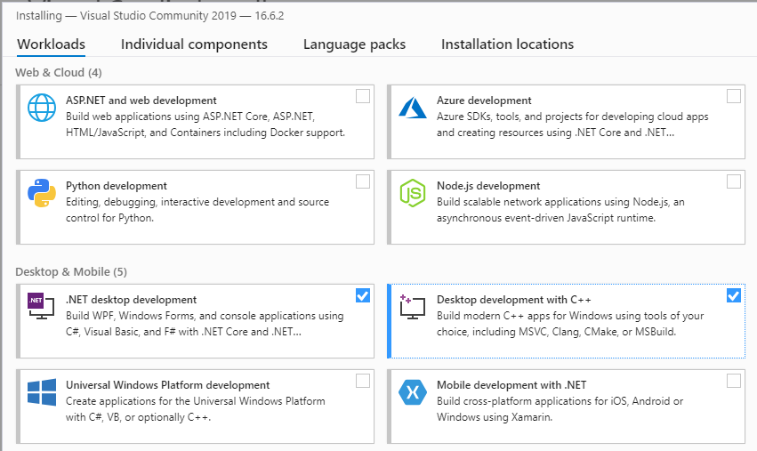

From **`Individual components`** select the last version of the Windows 10 SDK (`Win10SDK_10.0.19041`)

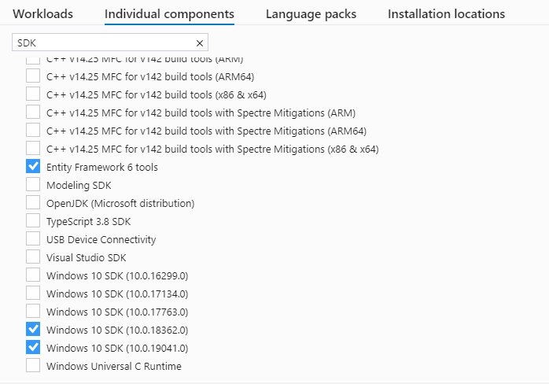

From **`Individual components`** (under the category `Compilers, build tools, and runtimes`) select the last version of the `C++ x64/x86 Spectre-mitigated libs`  (`MSVC v142 - VS 2019 C++ x64/x86 Spectre-mitigated libs (v14.26)`)

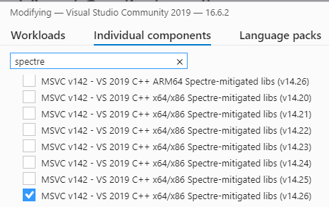

From **`Individual components`**: select all available versions of Python (Python 2: 32 and 64 bit, and Python3: 32 and 64 bit).

3. After that, go through the default steps and let it install:

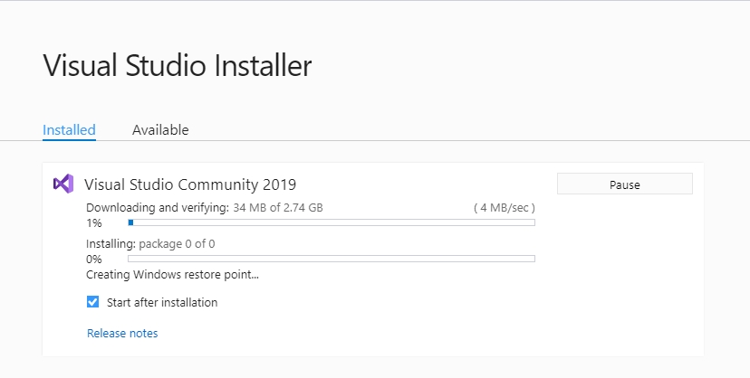

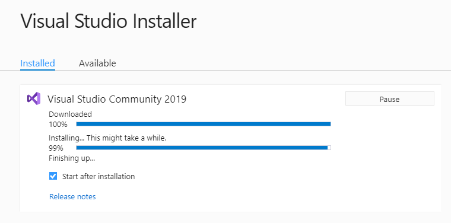


### Setting up the Windows Driver Kit

1. Run the WDK setup downloaded from [the given link](https://docs.microsoft.com/en-us/windows-hardware/drivers/download-the-wdk). Go through the default installation steps:

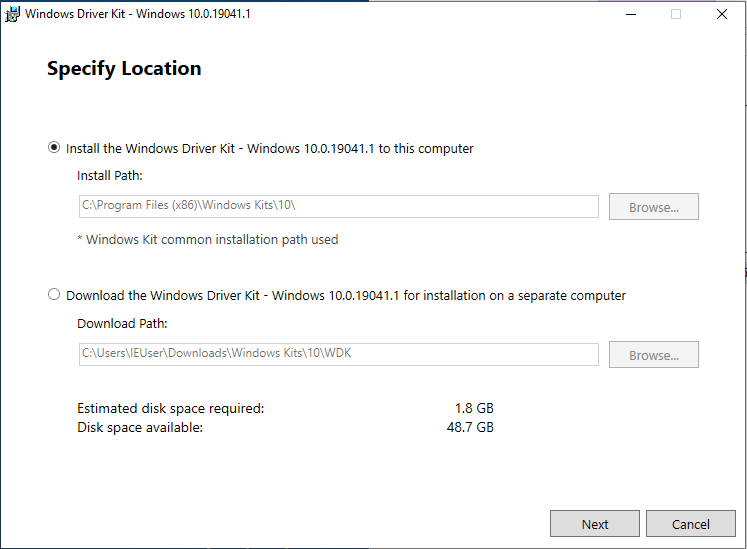

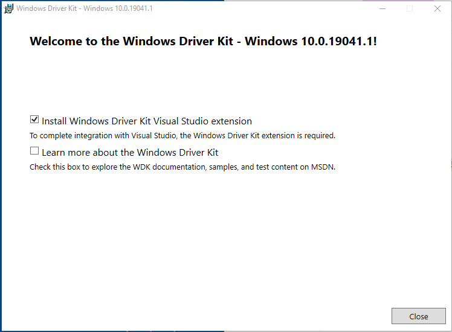

2. You will be asked if you want to install the extension for Visual Studio. Select it and install:

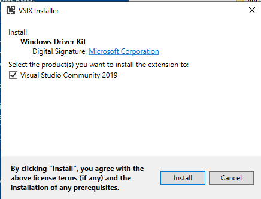

### Setting up the Windows Debugger (WinDbg)

1. Run the Windows SDK setup downloaded from [the given link](https://developer.microsoft.com/en-us/windows/downloads/windows-10-sdk/)

Select `Windows Debugging Tools`, and follow the default steps to install the WinDbg.

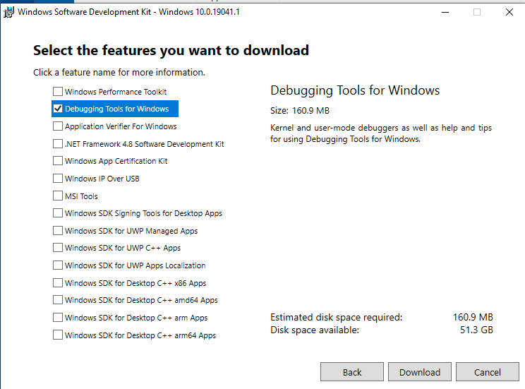

#### Add symbols

Once we have WinDbg installed. we should add Symbols. In order to do this, we just need to add an environment variable, to which WinDbg will automatically refer:
```
_NT_SYMBOL_PATH
```
… and fill it with the link from where it can download symbols.

https://msdl.microsoft.com/download/symbols

Full variable content may look like this (downloaded symbols will be stored in `C:\Symbols`):

```
SRV*C:\Symbols*https://msdl.microsoft.com/download/symbols
```

Edit environment variables and set it.

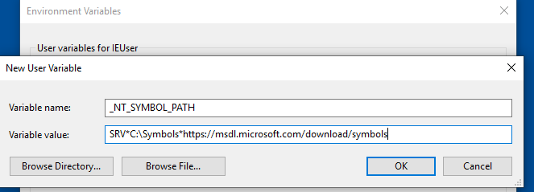


#### Enable Local Kernel Debugging.

During our training we will be viewing some system's internals under WinDbg. In order to do so, we need to have Local Kernel Debugging enabled. First, make sure that you followed the previous section about adding symbols. Then, follow the instructions:

+ Run commandline as Administrator.

```
bcdedit /debug on
```


+ Reboot the machine.

+ Run WinDbg (x64). `File` -> `Kernel Debug`. Select the tab `Local`. 
A window with Local Kernel Debugger (lkd) will appear.

(If the command prompt is not showing up, from the main menu choose: `Debug` -> `Break`).

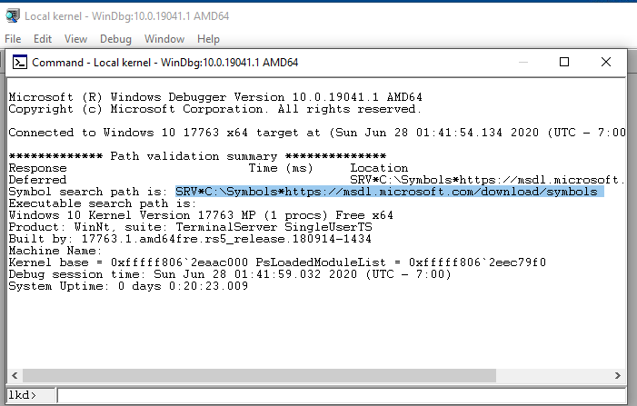

Among the displayed string you should see your symbols path mentioned:
```
Symbol search path is: SRV*C:\Symbols*https://msdl.microsoft.com/download/symbols
```

Deploy a sample command to check if everything works fine:

```
dt nt!_EPROCESS
```

## Install Reverse Engineering Utilities

+ Install Chocolatey, Download the script [install_choco.bat](https://gist.github.com/hashereware/32922bfaaa18e304208b609122fdf6c3#file-install_choco-bat) and run it as Administrator. Reboot the machine after the installation.
+ Install the applications via Chocolatey. Download the script [install_apps.bat](https://gist.github.com/hashereware/32922bfaaa18e304208b609122fdf6c3#file-install_apps-bat) and run it as Administrator. 

Additionally, you need to install the following applications that are not available via Chocolatey:
+ [Tiny Tracer](https://github.com/hasherezade/tiny_tracer) + Intel Pin Platorm ( [how to install](https://github.com/hasherezade/tiny_tracer/wiki/Installation) )
+ [tag_converter](https://github.com/hasherezade/tag_converter)
+ IDA Pro (recommended, if you have the license)
  + [IDA IFL plugin](https://github.com/hasherezade/ida_ifl) - for IDA Pro
+ [VB Decompiler Lite](https://www.vb-decompiler.org/download.htm)
+ [Immunity Debugger](https://www.immunityinc.com/products/debugger/)
+ OllyDbg addons:
  + custom settings: [ollydbg.ini](https://gist.github.com/hashereware/28e35c384dae69754ee6f972f6f00ecf#file-ollydbg-ini)
  + plugins: 
     + StrongOD, available [here](https://drive.google.com/drive/folders/1mvGjjtI8mkZY3LVfSDwyuMGSiPSRwkh-?usp=sharing)
     + ODBGScript, available [here](https://sourceforge.net/projects/odbgscript/files/English%20Version/)
+ [XVI32 hex editor](http://www.chmaas.handshake.de/delphi/freeware/xvi32/xvi32.htm#download) 
  
### Post-installation configuration

#### x64dbg

Grant to the normal user the full access to the directory where the debugger was installed. Otherwise you will not be able to save your analysis DB as a normal user.


## Save the VM state

After having all the tools installed, don't forget to make a snapshot. Create a new stapshot named: "Fresh with tools".
